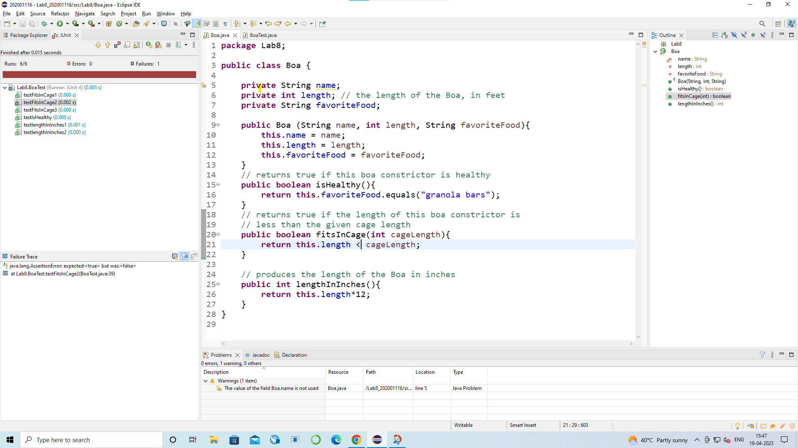

# Lab8_202001116

**SCREENSHOTS**

**LAB EXERCISE**

**CLASS CODE:** 

according to initial steps : 

**package** Lab8;

**public** **class** Boa {

`	`**private** String name;

`	`**private** **int** length; // the length of the Boa, in feet

`	`**private** String favoriteFood;

`	`**public** Boa (String name, **int** length, String favoriteFood){

`		`**this**.name = name;

`		`**this**.length = length;

`		`**this**.favoriteFood = favoriteFood;

`	`}

`	`// returns true if this boa constrictor is healthy

`	`**public** **boolean** isHealthy(){

`		`**return** **this**.favoriteFood.equals("granola bars");

`	`}

`	`// returns true if the length of this boa constrictor is

`	`// less than the given cage length

`	`**public** **boolean** fitsInCage(**int** cageLength){

`		`**return** **this**.length < cageLength;

`	`}

**}**

Adding one more function : 

// produces the length of the Boa in inches

`	`**public** **int** lengthInInches(){

`		`**return** **this**.length\*12;

`	`}

**TEST CASES :** 

**package Lab8;**

**import static org.junit.Assert.\*;**

**import org.junit.Before;**

**import org.junit.Test;**

**public class BoaTest {**
**

`	`**private Boa jen, ken;**
**

`	`**@Before**

`	`**public void setUp() throws Exception {**

`		`**jen = new Boa("Jennifer", 2, "grapes");**

`		`**ken = new Boa ("Kenneth", 3, "granola bars");**

`	`**}**

`	`**@Test**

`	`**public void testIsHealthy() {**
**

`		`***assertEquals*(false,jen.isHealthy());**

`		`***assertEquals*(true,ken.isHealthy());**

`	`**}**
**

`	`**@Test**

`	`**public void testFitsInCage1() {**
**

`		`***assertEquals*(false,jen.fitsInCage(1)); //less than cage size**
**

`		`***assertEquals*(false,ken.fitsInCage(2)); //less than cage size**
**

**

`	`**}**
**

`	`**@Test**

`	`**public void testFitsInCage2() {**
**

`		`***assertEquals*(true,jen.fitsInCage(2)); //equal to cage size**
**

`		`***assertEquals*(true,ken.fitsInCage(3)); //equal to cage size**
**

**

`	`**}**
**

`	`**@Test**

`	`**public void testFitsInCage3() {**
**

`		`***assertEquals*(true,ken.fitsInCage(4)); //greater than cage size**
**

`		`***assertEquals*(true,jen.fitsInCage(3)); //greater than cage size**

`	`**}**
**

`	`**@Test**

`	`**public void testlengthInInches1() {**

`		`**int output = jen.lengthInInches();**

`		`***assertEquals*(output,24);**

`	`**}**

`	`**@Test**

`	`**public void testlengthInInches2() {**

`		`**int output = ken.lengthInInches();**

`		`***assertEquals*(output,36);**

`	`**}**

**}**

**screenshot to running the test cases :** 

Here we can see when cage size is equal to length of object is returns false(due to failure of test case).

To fix this problem we will modify the code a little where  

**public** **boolean** fitsInCage(**int** cageLength){

`		`**return** **this**.length <= cageLength;

`	`}

after Changes : 

we can see now it runs.
